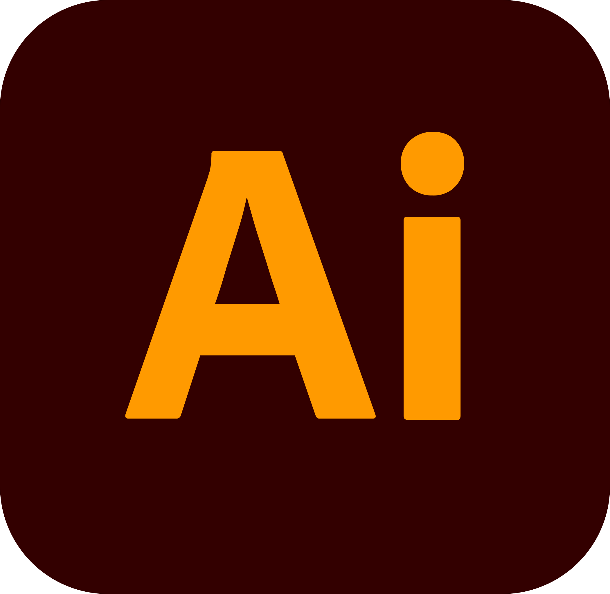

<h1 align="center">Team BIOT</h1>

 

 

 

 

## 💻 About

 

This repository contains our submission for the final 2022-2023 project - " "!

 

## 🗂️ Our Tech Stack

 

### Used code editor & collaborative service:

 

 

### Used tools for our visual elements:

 

 

### Used tools for our frontend development:

 

 

### Used tools for our documentation, presentation & communication:

 

 

 

## 📄 Documents

 

### QA Documentation

 

- [Test Plan](https://github.com/codingburgas/2122-the-games--adventures-atmos-final-project-2022/raw/main/docs/Atmos%20-%20Test%20plan.docx)
- [QA Documentation](https://github.com/codingburgas/2122-the-games--adventures-atmos-final-project-2022/raw/main/docs/Atmos%20-%20client%20QA%20Doc.xlsx)

 

### Code & Team Documentation

- [Team Documentation](https://github.com/codingburgas/2122-the-games--adventures-atmos-final-project-2022/raw/main/docs/Atmos%20-%20Documentation.docx)

 

### Presenting

 

- [Presentation](https://github.com/codingburgas/2122-the-games--adventures-atmos-final-project-2022/raw/main/docs/Atmos%20-%20Presentation.pptx)

 

 

## 🧒 Our Team

 

- <a href = "https://github.com/AMKolev22"> Alexander Kolev </a> (SCRUM Trainer) 
- <a href = "https://github.com/HPRusev22"> Hristo Rusev </a> (Frontend Developer)
- <a href = "https://github.com/PDDineva22"> Polina Dineva </a> (Frontend Developer)
- <a href = "https://github.com/VTVaradeva22"> Veselina Varadeva </a> (Designer)

 

 

<h1 align="center">Thanks for checking out our repo, show us some ❤️ by giving our repo a ⭐️!</h1>
